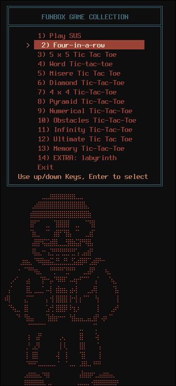
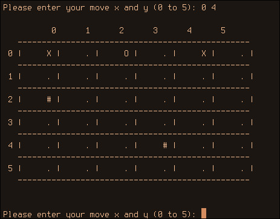
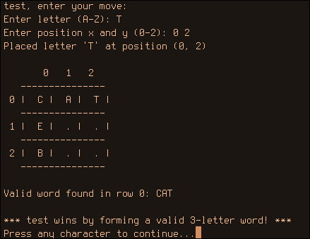
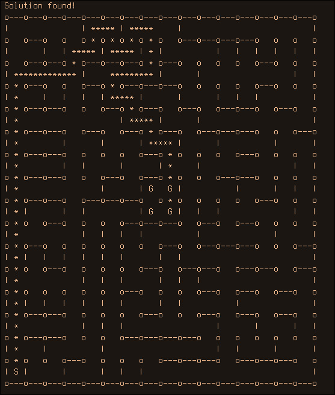

# Fun Box Collection

University C++ OOP Course. Terminal-based boardgame collection.

---

- SUS tic tac toe: generate as many "SUS" combinations as you can

- Four-in-a-Row:  Connect four pieces in a row to win

- 5×5 Tic-Tac-Toe:  Extended grid tactical gameplay

- Word Tic-Tac-Toe:   Strategic word-building variant

- Misère Tic-Tac-Toe:  Reverse objective: avoid three in a row

- Diamond Tic-Tac-Toe:  Unique diamond-shaped board layout

- 4×4 Tic-Tac-Toe:  Compact strategy challenge

- Pyramid Tic-Tac-Toe:  Multi-level 3D gameplay

- Numerical Tic-Tac-Toe:  Number-based strategic variant

- Obstacles Tic-Tac-Toe:  Navigate blocked square

- Infinity Tic-Tac-Toe:  Endless expandable grid

- Ultimate Tic-Tac-Toe:  Meta-game with 9 sub-boards

- Memory Tic-Tac-Toe:  Hidden pieces memory challenge

### Extras

- Labyrinth: Navigate through maze challenges

- Spaceship: avoid the falling asteroids

- Snake: Classic arcade growth game

## Quick Start
Prerequisites

C++17 compatible compiler (GCC 7+, Clang 5+, MSVC 2017+)
CMake 3.10 or higher

Build Instructions
bash# Clone the repository
git clone https://github.com/Nytril-ark/FunBox.git
cd FunBox

### Create build directory
mkdir build && cd build

### Configure and build
cmake ..
cmake --build .

or, on linux

cmake ..
make 

### Run the application
./BoardGameApp

# Screenshots

## Menu

## Obstacles Tic Tac Toe

## Word Tic Tac Toe

## Labyrinth

